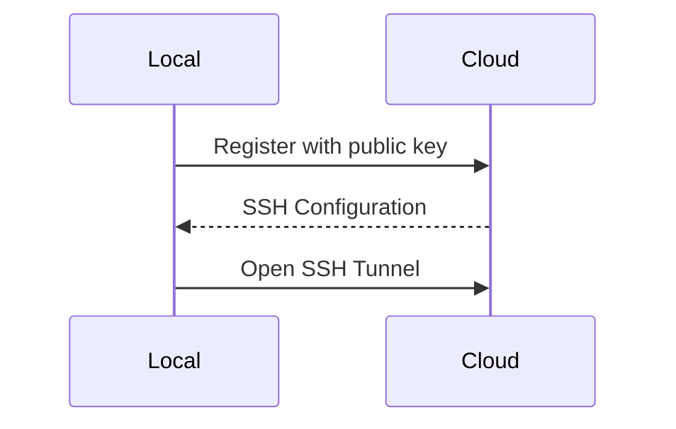
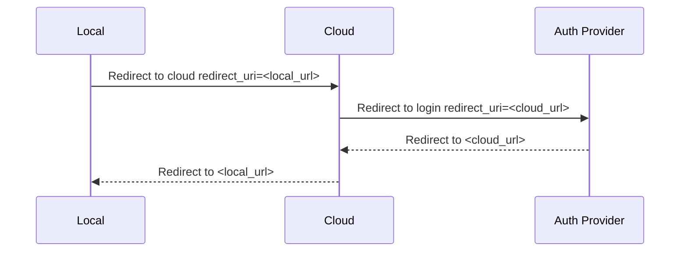

# Remote Gateway

The Remote Gateway 

## Remote Access

The local application opens a SSH Tunnel to the cloud gateway which tunnels the http frontend.



### Registration

To register with the cloud gateway the local application has to `POST` to the cloud gateway

```http
POST /api/gateway
Content-Type: application/json
---
{
	"public_key": "<public_key base64 encoded>",
	"preferred_prefix": "<optional prefix>"
}
```

The gateway responds with a remote url and the ssh user and url

```json
{
    "id": "<uuid>",
    "access_url": "https://<prefix>.<cloud-url>",
    "tunnel_url": "ssh://<tbd>@tunnel.<cloud-url>"
}
```

The local application has to ping the cloud gateway in regular intervals.

```http
POST /api/gateway/tunnel/<tunnel_id>/ping
```

On Startup the local application should ask whether the tunnel is still active

```http
GET /api/gateway/tunnel/<tunnel_id>
```

It returns with 204 when the tunnel exists and 404 when it doesn't.

### Tunnel

The local application opens a ssh tunnel to the configured `<tunnel_url>`.
All requests to the `<access_url>` are forwarded via port forwarding to the http frontend of the local application.

## OAuth Login



